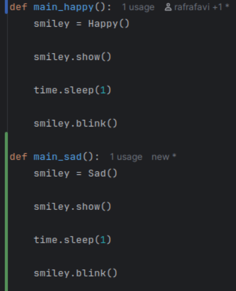

# Evidence and Knowledge

This document includes instructions and knowledge questions that must be completed to receive a *Competent* grade on this portfolio task.

## 1. Required evidence

### 1.1. Answer all questions in this document

- Each answer should be complete, well-articulated, and within the specified word count limits (if added) for each question.
- Please make sure **all** external sources are properly cited.
- You must **use your own words**. Please include your full chat transcripts if you use generative AI in any way.
- Generative AI hallucinates, is not an authoritative source

### 1.2. Make all the required modifications to the code

- Please follow the instructions in this document to make the changes needed to the code.

- When requested to upload evidence, upload all screenshots to `screenshots/` and embed them in this document. For example:

```markdown

```


> Note the `!`, and the use of a relative path.

- You must upload the code into your GitHub repository.
- While you can use a branch, your code should be in main when you submit.
- Upload a zip of this repository to Blackboard when you are ready to submit.
- You will be notified of your result via Blackboard
- However, if using GitHub classrooms, you may also receive additional feedback on GitHub directly

### 1.3. Optional: Use of Raspberry Pi and SenseHat

Raspberry Pi or SenseHat is **optional** for this activity. You can use the included `sense_hat.py` file to simulate the SenseHat on your computer.

If you use a Pi, please **delete** the `sense_hat.py` file.

### 1.4. Accessible version of the code

This project relies on visual patterns that appear on an LED matrix. If you have any accessibility requirements, you can use the `udl/accessible` branch to complete the project. This branch provides an accessible code version that uses text-based patterns instead of visual ones.

Please discuss this with your lecturer before using that branch.

## 2. Specific Tasks & Questions

Address the following tasks and questions based on the code provided in this repository.

### 2.1. Set up the project locally

1. Fork this repository (if not using GitHub Classrooms)
2. Clone your repository locally
3. Run the project locally by executing the `main.py` file
4. Evidence this by providing screenshots of the project directory structure and the output of the `main.py` file

)](screenshots/Evidence_1.png)

If you are running on a Raspberry Pi, you can use the following command to run the project and then screenshot the result:

```bash
ls
python3 main.py
```

### 2.2. Fundamental code comprehension

 Answer each of the following questions **as they relate to that code** supplied by in this repository (ignore `sense_hat.py`):

1. Examine the code for the `smiley.py` file and provide  an example of a variable of each of the following types and their corresponding values (`_` should be replaced with the appropriate values):

   | Type                    | name        | values |
   | ----------              |-------------|--------|
   | built-in primitive type | dimmed      | True   |
   | built-in composite type | self.pixels | Y, O   |
   | user-defined type       | _           | _      |

2. Fill in (`_`) the following table based on the code in `smiley.py`:

   | Object                   | Type  |
   | ------------             |-------|
   | self.pixels              | Tuple |
   | A member of self.pixels  | Int   |
   | self                     | Class |

3. Examine the code for `smiley.py`, `sad.py`, and `happy.py`. Give an example of each of the following control structures using an example from **each** of these files. Include the first line and the line range:

   | Control Flow | File      | First line | Line range |
   | ------------ |-----------| ------- |------------|
   |  sequence    | smiley.py | self.pixels = [| 17 - 26    |
   |  selection   | sad.py    | if wide_open: | 26 - 30    |
   |  iteration   | happy.py  |  for pixel in mouth:| 21 - 22    |

4. Though everything in Python is an object, it is sometimes said to have four "primitive" types. Examining the three files `smiley.py`, `sad.py`, and `happy.py`, identify which of the following types are used in any of these files, and give an example of each (use an example from the code, if applicable, otherwise provide an example of your own):

   | Type                    | Used?     | Example                                                                      |
   | ----------------------- |-----------|------------------------------------------------------------------------------|
   | int                     | sad.py    | mouth = [49, 54, 42, 43, 44, 45] (each number in the list is a int variable) |
   | float                   | happy.py  | delay=0.25                                                                   |
   | str                     | No        | Greeting = "Good morning"                                                    |
   | bool                    | smiley.py | dimmed=True                                                                  |

5. Examining `smiley.py`, provide an example of a class variable and an instance variable (attribute). Explain **why** one is defined as a class variable and the other as an instance variable.

> Your answer here
> An example of a class variable in smiley.py would be class Smiley:, as it is only declared at the start and referred to using self.
> An example of an instance variable in smiley.py would be self.pixels as it refers to an existing attribute in the init function smiley.py.

6. Examine `happy.py`, and identify the constructor (initializer) for the `Happy` class:
   1. What is the purpose of a constructor (in general) and this one (in particular)?

   > Your answer here
   > The purpose of an init class (constructor) is to initialise variables that will be used in the program, an example in the happy.py would be self.draw_mouth().

   2. What statement(s) does it execute (consider the `super` call), and what is the result?

   > Your answer here
   > The super in the happy.py initializer is used to execute the init present in smiley.py, the result is a happy smiley being displayed in the mock sensehat.

### 2.3. Code style

1. What code style is used in the code? Is it likely to be the same as the code style used in the SenseHat? Give to reasons as to why/why not:

> Your answer here
> The code style used in the program is PEP8, this style is likely present in sense_hat.py as it uses the same capitalisation for classes as all other files.

2. List three aspects of this convention you see applied in the code.

> Your answer here
> - classes all have first letter of each word capitalized (eg. class SenseHat:)
> - method definitions are all separated one space from each other.
> - statements such as if, else, for and while all utilise colons to define the start of their functionality.

3. Give two examples of organizational documentation in the code.

> Your answer here
> Two examples would be:
> - Blinks the smiley's eyes once :param delay: Delay between blinks (in seconds) (happy.py)
> - Renders a mouth by blanking the pixels that form that object. (happy.py)
> both of these examples are documentation that explains how each function works and is usually an industry standard present in program documentation

### 2.4. Identifying and understanding classes

> Note: Ignore the `sense_hat.py` file when answering the questions below

1. List all the classes you identified in the project. Indicate which classes are base classes and which are subclasses. For subclasses, identify all direct base classes.
  
  Use the following table for your answers:

| Class Name | Super or Sub? | Direct parent(s)          |
|------------|------|---------------------------|
| NotReal    | Sub  | NotRealParent             |
| Happy      | Sub  | Smiley & Blinkable        |
| Sad        | Sub  | Smiley                    |
| Smiley     | Super| None                      |
| Blinkable  | Super| ABC (This is a meta class)|


2. Explain the concept of abstraction, giving an example from the project (note "implementing an ABC" is **not** in itself an example of abstraction). (Max 150 words)

> Your answer here
> Abstraction in OOP is a concept that is all about the process of removing certain attributes to focus on more important
> details that are present in a program. An example present in the code would be the abstraction present in the Happy class
> which uses a abstract method from the Blinkable class, this method is called def blink:.

3. What is the name of the process of deriving from base classes? What is its purpose in this project? (Max 150 words)

> Your answer here
> This is called Inheritance, the purpose it has in this project is to inherit values form smiley.py via the Smiley super class.
> This process allows for the program to display the smiley via the sensehat as it is intended.

### 2.5. Compare and contrast classes

Compare and contrast the classes Happy and Sad.

1. What is the key difference between the two classes?
   > Your answer here
   > The key difference is that the Blinkable super class is used in happy.py while it is not used in sad.py
2. What are the key similarities?
   > Your answer here
   > Key similarities include its use of inheritance with smiley.py and the code structure used in both files is identical.
3. What difference stands out the most to you and why?
   > Your answer here
   > The difference that stands out the most would be the lack of a Blinkable super class present in 
4. How does this difference affect the functionality of these classes
   > Your answer here
   > This difference effectively means that the display of the sad smiley inhibits no blinking functionality which also explains
>    the smaller amount of lines in sad.py compared to happy.py.

### 2.6. Where is the Sense(Hat) in the code?

1. Which class(es) utilize the functionality of the SenseHat?
   > Your answer here
   > The Smiley, Sad and Happy classes utilise the sense hat ( with the Sad and Happy classes inheriting the Smiley class)
2. Which of these classes directly interact with the SenseHat functionalities?
   > Your answer here
   > The Smiley class directly interacts with the SenseHat functionalities while the other classes use Inheritance as stated above.
3. Discuss the hiding of the SenseHAT in terms of encapsulation (100-200 Words)
   > Your answer here
   > The Smiley class uses encapsulation methods in order to restrict direct access to certain functions from the SenseHat class in sensehat.py.
>    This is used to access the functions in the SenseHat class in the Smiley class without having to effectively make the 
>     functions in smiley.py.

### 2.7. Sad Smileys Can’t Blink (Or Can They?)

Unlike the `Happy` smiley, the current implementation of the `Sad` smiley does not possess the ability to blink. Let's first explore how blinking has been implemented in the Happy Smiley by examining the blink() method, which takes one argument that determines the duration of the blink.

**Understanding Blink Mechanism:**

1. Does the code's author believe that every `Smiley` should be able to blink? Explain.

> Your answer here
> I believe that the code author intends on implementing blinking to sad.py as the method present in happy.py
> is designed to be easily transferable between files especially with the draw_eyes methods for both
> classes being identical to each other in terms of functionality.

2. For those smileys that blink, does the author expect them to blink in the same way? Explain.

> Your answer here
> Yes, the author intends for them to blink in the same manner as there is a parameter for delay with a fixed float
> amount representing delay in blinking in happy.py via the means of using the abstract method from blinkable.py.

3. Referring to the implementation of blink in the Happy and Sad Smiley classes, give a brief explanation of what polymorphism is.

> Your answer here
> Polymorphism in programming relates to multiple aspects of OOP, 
> however in relation to the implementation of def blink: in happy.py, polymorphism has been used to
> bring methods from the super class Blinkable for use in the class Happy.

4. How is inheritance used in the blink method, and why is it important for polymorphism?

> Your answer here
> Inheritance is used in the blink method by inheriting values present in the Happy class. This is
> important for polymorphism as it allows for the use of methods present in other files.
1. **Implement Blink in Sad Class:**

   - Create a new method called `blink` within the Sad class. Ensure you use the same method signature as in the Happy class:

   ```python
   def blink(self, delay=0.25):
       pass  # Replace 'pass' with your implementation
   ```

2. **Code Implementation:** Implement the code that allows the Sad smiley to blink. Use the implementation from the Happy Smiley as a reference. Ensure your new method functions similarly by controlling the blink duration through the `delay` argument.

3. **Testing the Implementation:**

- Test the new blink functionality on your Raspberry Pi or within the Python classes provided. You might need to adjust the `main.py` script to incorporate Sad Smiley's new blinking capability.

Include a screenshot of the sad smiley or the modified `main.py`:



- Observe and document the Sad smiley as it blinks its eyes. Describe any adjustments or issues encountered during implementation.

  > Your answer here
  > I decided to make an adjustment to main.py by adding a method to call the Sad class and its functions separately from the method that
  > calls the happy class, this was to avoid the sensehat crashing due to multiple executions. 

  ### 2.8. If It Walks Like a Duck…

  Previously, you implemented the blink functionality for the Sad smiley without utilizing the class `Blinkable`. Assuming you did not use `Blinkable` (even if you actually did), consider how the Sad smiley could blink similarly to the Happy smiley without this specific class.

  1. **Class Type Analysis:** What kind of class is `Blinkable`? Inspect its superclass for clues about its classification.

     > Your answer here
     > Blinkable is a abstract class that specifies blink-ability with in the class it is used in. Without the use of this class,
     > it can blink by being defined in the file each that it is being implemented in rather than carrying it over using abstraction (although abstraction is quicker to do).

  2. **Class Implementation:** `Blinkable` is a class intended to be implemented by other classes. What generic term describes this kind of class, which is designed for implementation by others? **Clue**: Notice the lack of any concrete implementation and the naming convention.

  > Your answer here
  > This is an abstract class as it is being implemented from the blinkable.py as a super class without any concrete method functionality.
  > It is effectively a template designed for later use.

  3. **OO Principle Identification:** Regarding your answer to question (2), which Object-Oriented (OO) principle does this represent? Choose from the following and justify your answer in 1-2 sentences: Abstraction, Polymorphism, Inheritance, Encapsulation.

  > Your answer here
  > This represents the abstraction principle as it is used to abstract functionality from methods in a class that have no defined functionality.

  4. **Implementation Flexibility:** Explain why you could grant the Sad Smiley a blinking feature similar to the Happy Smiley's implementation, even without directly using `Blinkable`.

  > Your answer here
  > This could be done as even without the Blinkable class, the method can have its functionality defined by what exists in 
  > the class that it is in.

  5. **Concept and Language Specificity:** In relation to your response to question (4), what is this capability known as, and why is it feasible in Python and many other dynamically typed languages but not in most statically typed programming languages like C#? **Clue** This concept is hinted at in the title of this section.

  > Your answer here
  > This capability is known as dynamic capability, this is what allows for methods to be implemented with less specificity behind its functionality.
  > While it works in python it wouldn't work in a language such as C# as statistical languages such as C# require the user to
  > specify the exact type of functionality needed in order for it to work.

  ***

  ## 3. Refactoring

  ### 3.1. Does a Smiley Have to Be Yellow?

  While our current implementation predominantly features yellow smileys, emotional expressions like sickness or anger typically utilize colors like green, red, or orange. We'll explore the feasibility of integrating these colors into our smileys.

  1. **Defined Colors and Their Location:**

     1. Which colors are defined and in which class(s)?
        > Yellow and blank are defined in smiley.py directly, happy.py and sad.py have Yellow and Blank implemented via inheritance.
     2. What type of variables hold these colors? Are the values expected to change during the program's execution? Explain your answer.
        > These eyes colours are designed to be fixed as they are intended to use the BLANK variable for each pixel that requires them to be blank.
        > The primary colour for the face however, is intended to have a degree of flexibility as multiple different colour variables are explicitly mentioned
        > in the Smiley class.
     3. Add the color blue to the appropriate class using the appropriate format and values.

  2. **Usage of Color Variables:**

     1. In which classes are the color variables used?
        > The Happy and Sad classes both use these, taking them from the super class, Smiley.

  3. **Simple Method to Change Colors:**
  4. What is the easiest way you can think to change the smileys to green? Easiest, not necessarily the best!
     > The easiest method to change the smileys colour would be to add a method into the Smiley class that
>      could allow for selections to be made based on the avaliable colours in the Smiley class.


  ### 3.2. Flexible Colors – Step 1

  Changing the color of the smileys once is straightforward, but it isn't very flexible. To facilitate various colors for smileys, it is advisable not to hardcode values in any class. This approach was identified earlier as a necessary change. Let's start by removing the built-in assumptions about color in our classes.

  1. **Add a method called `complexion` to the `Smiley` class:** Implement this instance method to return `self.YELLOW`. Using the term "complexion" instead of "color" provides a more abstract terminology that focuses on the meaning rather than implementation.

  2. **Refactor subclasses to use the `complexion` method:** Modify any subclass that directly accesses the color variable to instead utilize the new `complexion` method. This ensures that color handling is centralized and can be easily modified in the future.

  3. **Determine the applicable Object-Oriented principle:** Consider whether Abstraction, Polymorphism, Inheritance, or Encapsulation best applies to the modifications made in this step.

  4. **Verify the implementation:** Ensure that the modifications function as expected. The smileys should still display in yellow, confirming that the new method correctly replaces the direct color references.

  This step is crucial for setting up a more flexible system for color management in the smiley display logic, allowing for easy adjustments and extensions in the future.

  ### 3.3. Flexible Colors – Step 2

  Having removed the hardcoded color values, we now enhance the base class to support dynamic color assignments more effectively.

  1. **Modify the `__init__()` method in the `Smiley` class:** Introduce a default argument named `complexion` and assign `YELLOW` as its default value. This allows the instantiation of smileys with customizable colors.

  2. **Introduce a new instance variable:** Create a variable called `my_complexion` and assign the `complexion` parameter to it. This step ensures that each smiley instance can maintain its own color state.

  3. **Rationale for `my_complexion`:** Using a distinct instance variable like `my_complexion` avoids potential conflicts with the method parameter names and clarifies that it is an attribute specific to the object.

  4. **Bulk rename:** We want to update our grid to use the value of complexion, but we have so many `Y`'s in the grid. Use your IDE's refactoring tool to rename all instances of the **symbol** `Y` to `X`. Where `X` is the value of the `complexion` variable. Include a screenshot evidencing you have found the correct refactor tool and the changes made.

  

  5. **Update the `complexion` method:** Adjust this method to return `self.my_complexion`, ensuring that whatever color is assigned during instantiation is what the smiley displays.

  6. **Verification:** Run the updated code to confirm that Smileys still defaults to yellow unless specified otherwise.

  ### 3.4. Flexible Colors – Step 3

  With the foundational changes in place, it's now possible to implement varied smiley colors for different emotional expressions.

  1. **Adjust the `Sad` class initialization:** In the `Sad` class's initializer method, change the superclass call to include the `complexion` argument with the value `self.BLUE`, as shown:

     ```python
     super().__init__(complexion=self.BLUE)
     ```

  2. **Test color functionality for the Sad smiley:** Execute the program to verify that the Sad smiley now appears blue.

  3. **Ensure the Happy smiley remains yellow:** Confirm that changes to the Sad smiley do not affect the default color of the Happy smiley, which should still display in yellow.

  4. **Design and Implement An Angry Smiley:** Create an Angry smiley class that inherits from the `Smiley` class. Set the color of the Angry smiley to red by passing `self.RED` as the `complexion` argument in the superclass call.

  ***
